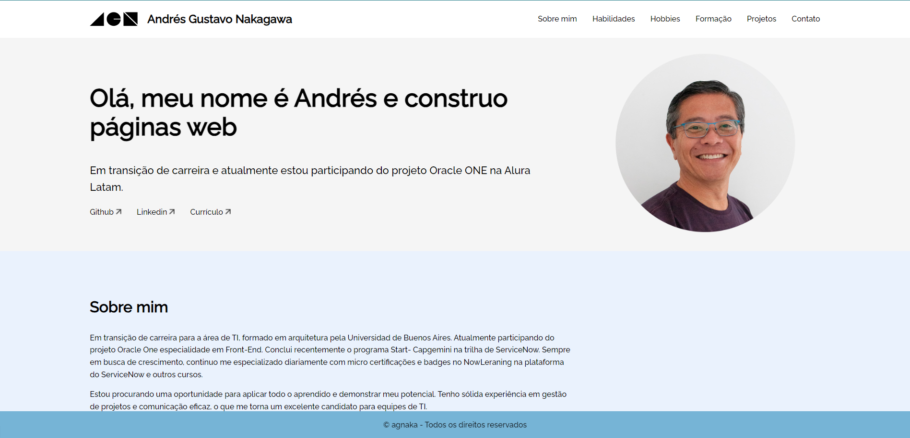
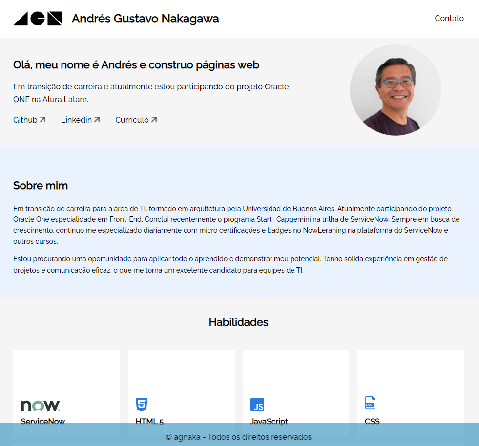
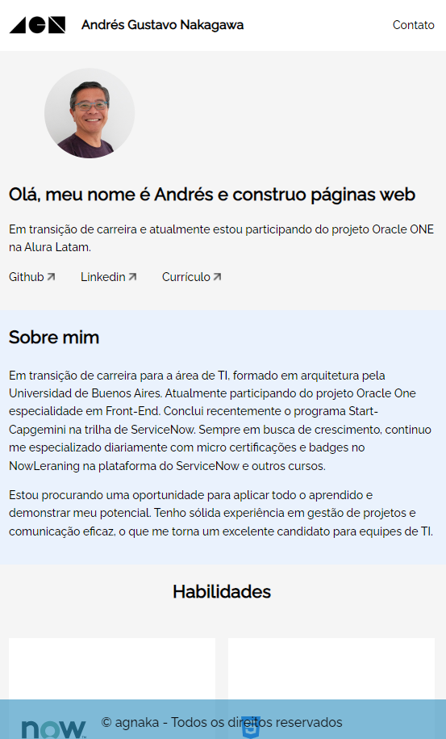

### <h2>Portfólio</h2> 
**Considerações inicias**

Este site faz parte do programa Oracle One - Oracle Next Education

**_Imagem do Site_**
A imagem do background foi solicitada ao Gemini especificando o mais possível no prompt o que estava querendo.

  <figure>
    
    Desktop
  </figure>
  <figure>
    
    Tablet
  </figure>
  <figure>
    
    Celular
  </figure>

 

**Tecnologias utilizadas:**

*  
* 
* 
 

**Responsividade:**

Responsividade paa dispositivos mobile tablet e celular

**Semântica e acessibilidade:**

Com assistência do Google Gemini foi melhorada a semântica e a acessibilidade do site

<h2>Autor</h2> 

 Andrés Nakagawa

**#potfolios #programação #javascript #html #css #open-source**

